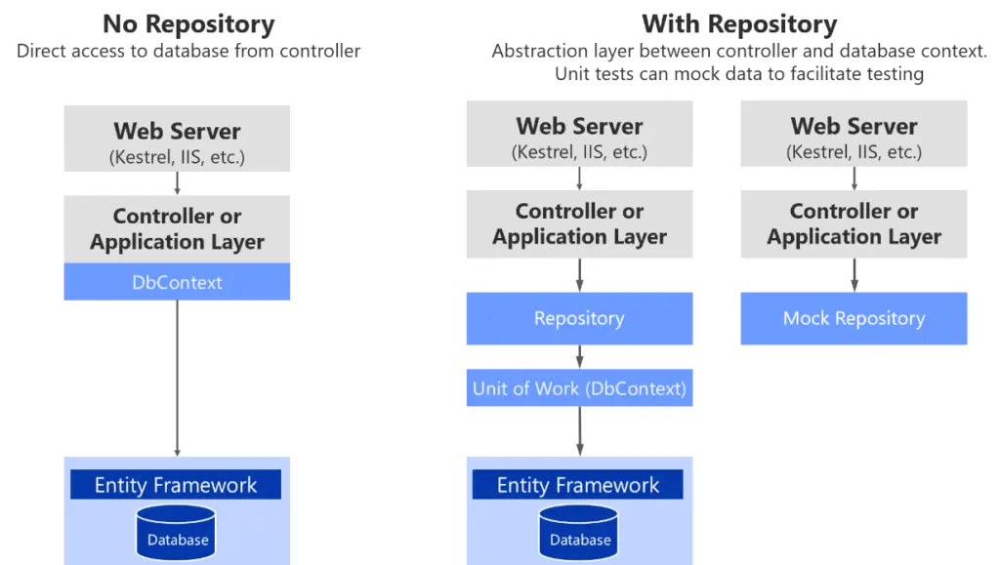

# Repository Pattern Example in ASP.NET Core

## Custom Repository vs DBContext

## Implementing Repository Pattern
### Features and purposes
* **Domain** – Holds the Entities and Interfaces. It does not depend on any other project in the solution.
* **DataAccess** – Since we will be using Entity Framework Core – Code First Apporach to interact with our Database, let’s build a project that solely represents everything related to EFCore. The aim is that, later down the road one can easily build another Data Access layer like DataAccess.Dapper or so. And our application would still support it. Here is where Dependency Inversion comes to play.
* **Api** – the presentation layer of the entire solution. It depends on both the projects.

### Two endpoints for controller, A POST and a GET Method
* Get all the Popular Developers.
* Insert a new Developer to a new Project.

## Summary
* Repository Pattern in ASP.NET Core Application
* Generic Repositories
* Unit Of Work